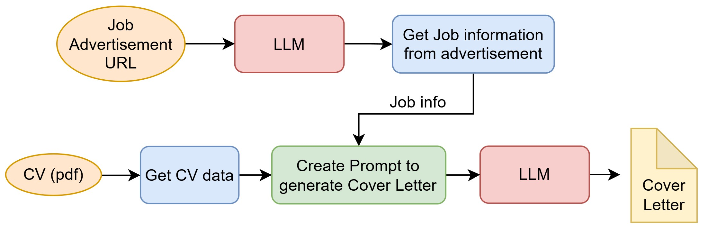

## Motivation letter generator with LLMs given CV and job advertisement

This project focuses on LLM based GenAI application to generate Motivation Letters for given Job Advertisements and CV. 

### Motivation: 
When applying to a job, it is common to submit a cover letter explaining why the candidate is interested in this role and outlining their experience, skills, knowledge, and education. However, it is also a bit of work, and LLMs can help with creating one according to the job advertisement and CV.

### Method:
The project mainly uses a Streamlit user interface application, where users can enter job advertisements and CVs. The application then generates a cover letter using an LLM with both inputs. The project uses Groq and Langchanin frameworks in the backend to handle and process data and LLMs. The following flow diagrams explain the system architecture.



* This project utilizes `llama-3.1-70b-versatile` LLM model deployed in Groq (cloud server) via api-key.
* Langchain framework to process data including invoking LLM with prompts, web scraping (to get job post) and process data.

### How to use

1. Intsall the required dependencies using ```requirements.txt``` file.
2. Get an API key from [here](https://console.groq.com/keys.) and place is under `src/.env` under `API_KEY`.
3. Change directory to `src` and run the Streamlit application by running
    ```commandline
    streamlit run app.py
    ```
4. Enter the interested job URL and CV, in pdf format only, then press `Submit and Generate` button.

### Outcome

This project has conducted as a introductornary level learning excerise to how to use LLMs from cloud via api, Langchain to prompt and invoke to get desired outcome with a LLM, and utilizing Streamlit to build a simple UI to interact with. Please feel free to report and issues you find. Thanks !
